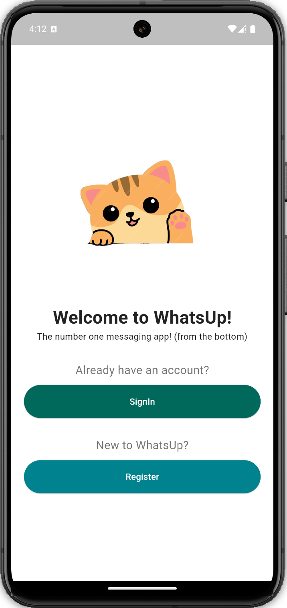

# WhatsUp
A simple chat app project I made to learn more about Flutter mobile development.

|  |  |  |
|------------------------|------------------------|------------------------|

## Features

- **User Authentication**: Secure user login and registration using Firebase Authentication.
- **User Search**: Search for users through a dedicated search screen that queries Firestore.
- **Local Data Storage**: Chats and messages are stored locally on the device using `sqflite` for offline access.
- **Real-time Messaging**: Messages are sent using Firestore's real-time synchronization features for instant updates.
- **Message Status Indicator**: A system showing the status of messages as sent, delivered, or read. Messages are deleted from Firestore after the sender confirms they were read, reducing server load.

## Future Goals

- Add support for sending images and videos within chats.
- Add a dark theme to the UI, along with customizability and privacy settings for the user.
- Implement the ability to edit or delete sent messages.
- Refactor the Firebase backend in another repository using Node.js to gain more low-level experience with custom backend development.

## Technologies Used

- **Flutter**: For building the mobile app.
- **Firebase Authentication**: For user authentication and login.
- **Firestore**: For real-time message synchronization and user data.
- **Firebase Storage**: For storing user profile pictures.
- **SQLite (`sqflite` package)**: For local data storage on the device.
